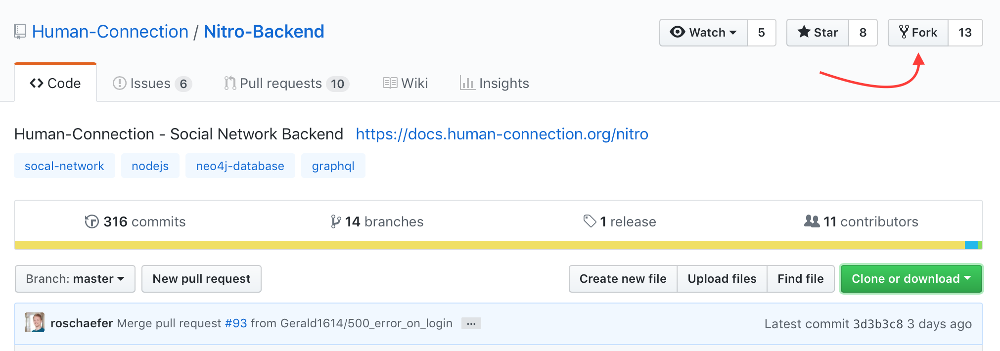

# Backend Installation

The Backend repository can be found on GitHub. [https://github.com/Human-Connection/Nitro-Backend](https://github.com/Human-Connection/Nitro-Backend)


TODO: Create documentation section for How to Start and Beginners.


Here are some general informations about our [GitHub Standard Fork & Pull Request Workflow](https://gist.github.com/Chaser324/ce0505fbed06b947d962).

### Fork the Repository

Click on the fork button.



### Clone your new Repository

Set the current working folder to the path in which the backend repository should be cloned \(copied\).

```bash
$ cd PATH-FOR-NITRO-BACKEND
```

For cloning your new repository to your local machine modify the following command to add your GitHub user name.




```bash
$ git clone https://github.com/YOUR-GITHUB-USERNAME/Nitro-Backend.git
```





```bash
$ git clone git@github.com:YOUR-GITHUB-USERNAME/Nitro-Backend.git
```




Change into the new folder.

```bash
$ cd Nitro-Backend
```

Add the original Human Connection repository as `upstream`. This prepares you to synchronize your local clone with a simple pull command in the future.




```bash
$ git remote add upstream https://github.com/Human-Connection/Nitro-Backend.git
```





```bash
$ git remote add upstream git@github.com:Human-Connection/Nitro-Backend.git
```




### Copy Environment Variables

```bash
$ cp .env.template .env
```

Configure the file `.env` according to your needs and your local setup.
