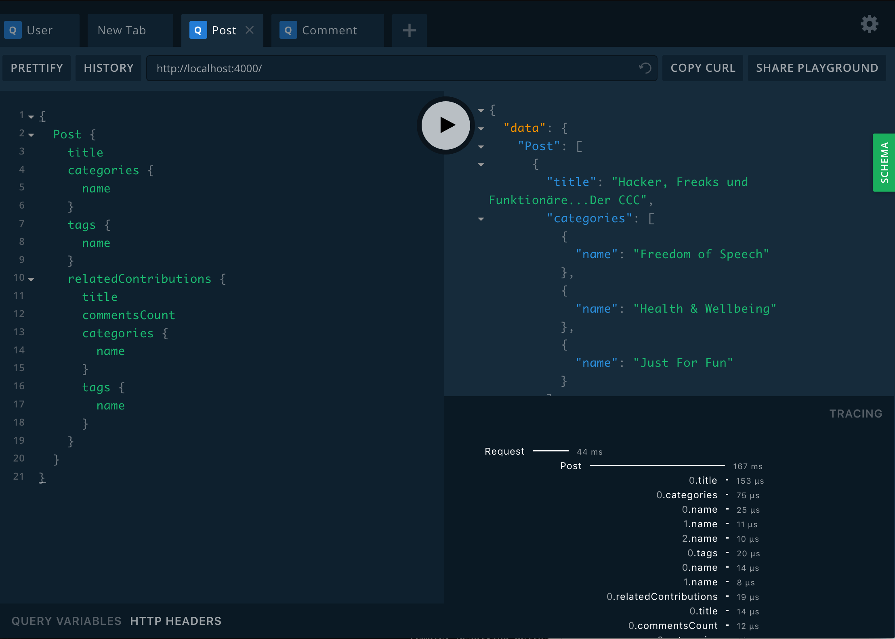

# Backend

## Installation with Docker

Run the following command to install everything through docker.

The installation takes a bit longer on the first pass or on rebuild ...

```bash
$ docker-compose up

# rebuild the containers for a cleanup
$ docker-compose up --build
```

Wait a little until your backend is up and running at [http://localhost:4000/](http://localhost:4000/).

## Installation without Docker

For the local installation you need a recent version of [node](https://nodejs.org/en/)
(&gt;= `v10.12.0`).

Install node dependencies with [yarn](https://yarnpkg.com/en/):
```bash
$ cd backend
$ yarn install
```

Copy Environment Variables:
```bash
# in backend/
$ cp .env.template .env
```
Configure the new file according to your needs and your local setup. Make sure
a [local Neo4J](http://localhost:7474) instance is up and running.

Start the backend for development with:
```bash
$ yarn run dev
```

or start the backend in production environment with:
```bash
yarn run start
```

Your backend is up and running at [http://localhost:4000/](http://localhost:4000/)
This will start the GraphQL service \(by default on localhost:4000\) where you
can issue GraphQL requests or access GraphQL Playground in the browser.




#### Seed Database

If you want your backend to return anything else than an empty response, you
need to seed your database:




In another terminal run:
```bash
$ docker-compose exec backend yarn run db:seed
```

To reset the database run:
```bash
$ docker-compose exec backend yarn run db:reset
# you could also wipe out your neo4j database and delete all volumes with:
$ docker-compose down -v
```



Run:
```bash
$ yarn run db:seed
```

To reset the database run:
```bash
$ yarn run db:reset
```




# Testing

**Beware**: We have no multiple database setup at the moment. We clean the
database after each test, running the tests will wipe out all your data!





Run the _**jest**_ tests:

```bash
$ docker-compose exec backend yarn run test:jest
```

Run the _**cucumber**_ features:

```bash
$ docker-compose exec backend yarn run test:cucumber
```





Run the _**jest**_ tests:

```bash
$ yarn run test:jest
```

Run the _**cucumber**_ features:

```bash
$ yarn run test:cucumber
```



