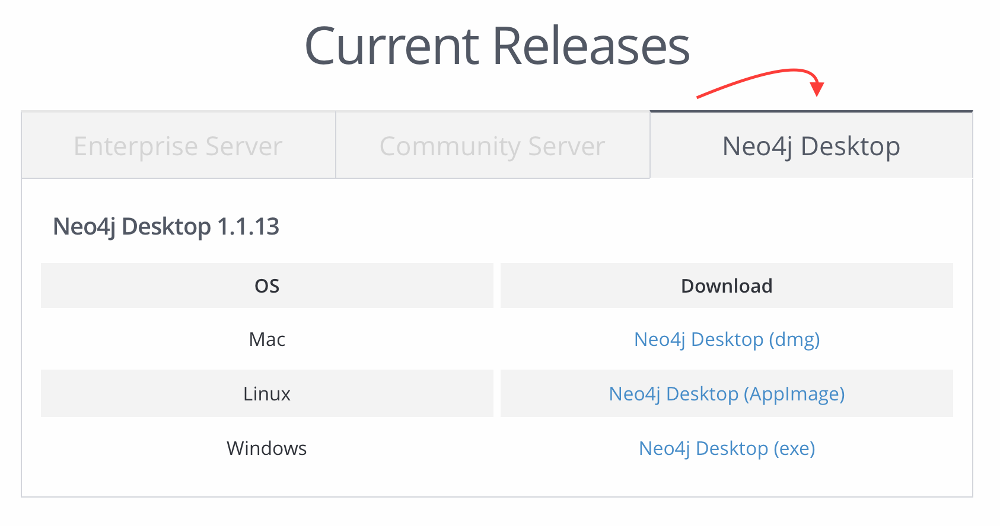

# Local Installation

Make sure you have a recent version of node - we currently use 10.15.1

```bash
$ node -v
v10.15.1
```

Make sure that you have a recent version of [yarn](https://yarnpkg.com/en/) or [npm](https://www.npmjs.com) installed before you proceed. E.g. we have the following versions:

```bash
$ yarn --version
1.12.3
$ npm --version
6.4.1
```

If the `yarn` or `npm` command is unknown you may use the [docker installation](./#installation-and-usage-with-docker) \(see above\) or contact the developer team at [Discord](https://discord.gg/6ub73U3) if you have any questions:

## Install Dependencies



```bash
$ yarn install
```



```bash
$ npm install
```



## Start the Server




### Development

```bash
$ yarn run dev
```

### Production

```bash
# you will need to build the app first
$ yarn run build
# run after build (dist folder must exist)
$ yarn run start
```




### Development

```bash
$ npm run dev
```

### Production

```bash
# you will need to build the app first
$ npm run build
# run after build (dist folder must exist)
$ npm run start
```




This will start the GraphQL service \(by default on [http://localhost:4000](http://localhost:4000)\) where you can issue GraphQL requests or access GraphQL Playground in the browser.


But before you can issue GraphQL requests or access GraphQL Playground you have to install, start and seed your Neo4j database. See following step …


## Neo4j Installation and Configuration

### Configure Environment

Set your Neo4j connection string and credentials in `.env`. For example:




```yaml
NEO4J_URI=bolt://localhost:7687
NEO4J_USER=neo4j
NEO4J_PASSWORD=letmein
```




### Neo4j Installation


You **need to install APOC** as a plugin for the graph you create in neo4j!


Note that grand-stack-starter does not currently bundle a distribution of Neo4j. Now there are a lot alternatives how to install Neo4J.




You can [download Neo4j Desktop](https://neo4j.com/download-center/) run locally for development. Choose tab **Neo4j Desktop**.



After the download is done install the Neo4j Desktop application and open it. E.g. we have the following version:

```text
Neo4j Desktop 1.1.13
```

Click on the empty project **My Project** to choose it.

Click in the **Add Graph** area and after two buttons appear in it click on **Create a Local Graph**.

Optionally, set the name of the new Graph for clarity to **Human Connection DB**. Set the password to **letmein** which is our default password of our `.env.template`. You can choose another password and later change your connection settings, too. Then click on **Create** and the database will be generated.

After generation of the database was successful, please click in the **Add Plugin** area. Then click the **Install** button of the **APOC** area. Now an additional **Install** button appears and you click on it again. If the **APOC-Plugin** is installed by now close the **Plugins** window.

In the **Human Connection DB** area is a **Manage** button. By clicking it the area switches into a manage area with a lot of information and setting possibilities.

Start the Graph database by clicking the **Play-Symbol** button. In the **Logs** tab you'll find the status of the start up.

If you have a look in the **Details** tab you find the connection info. The bolt port should be `7687` as we set it for our [environment configuration](docker-backend.md#configure-environment) above.




You can spin up a [hosted Neo4j Sandbox instance](https://neo4j.com/download-center/), run Neo4j in one of the [many cloud options](https://neo4j.com/developer/guide-cloud-deployment/), [spin up Neo4j in a Docker container](https://neo4j.com/developer/docker/) or on Debian-based systems install [Neo4j from the Debian Repository](http://debian.neo4j.org/). Just be sure to update the Neo4j credentials in `.env`.

#### Install APOC plugin on Debian-based systems

Install `neo4j` from the Debian Repository, then [download the APOC plugin](https://github.com/neo4j-contrib/neo4j-apoc-procedures/releases/download/3.4.0.3/apoc-3.4.0.3-all.jar) to the `/var/lib/neo4j/plugins` directory, e.g. with:

```bash
$ wget https://github.com/neo4j-contrib/neo4j-apoc-procedures/releases/download/3.5.0.1/apoc-3.5.0.1-all.jar -P /var/lib/neo4j/plugins
```




### Database Informations and Commands via Browser

Information about your Neo4j database can be obtained in your browser via [http://localhost:7474/browser/](http://localhost:7474/browser/).
You can even send commands to Neo4j here. For example, for creating indices, as described in the next step.

### Create Indices in Neo4j


TODO: Is there a terminal command to create indices in Neo4j, because that would be a more general solution …


To create the required indexes in Neo4j, you must send the following command to the database using the [browser command line](#database-informations-and-commands-via-browser), see above.

```sh
$ CALL db.index.fulltext.createNodeIndex("full_text_search",["Post"],["title", "content"]);
```

### Seeding Database with Data

Now we have to seed our database with default data, so that GraphQL requests or playing with our GraphQL Playground returns anything else than an empty response.

To fill the database with some seed data, run the following command in your terminal:

```bash
$ yarn run db:seed
```

To wipe out the database:

```bash
$ yarn run db:reset
```

Now your backend is ready for requests. You can click on the **Open Browser** button in Neo4j Desktop to check if the seeding was successful or open [http://localhost:7474/](http://localhost:7474/) in your browser.

Click the **Data-Symbol** at the left upper corner and then click on the **Node Label** + **User** to see a graph of the user relations, as an example.
