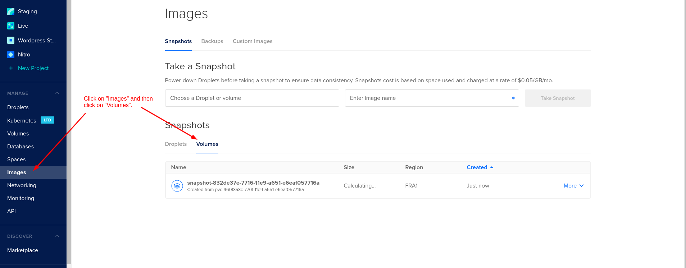

# Kubernetes Volume Snapshots

It is possible to backup persistent volumes through volume snapshots. This is
especially handy if you don't want to stop the database to create an [offline
backup](../neo4j-offline-backup/README.md) thus having a downtime.

## Create a Volume Snapshot

There is an example in this folder how you can e.g. create a volume snapshot for
the persistent volume claim `neo4j-data-claim`:

```sh
# in folder deployment/volumes/volume-snapshots/
kubectl apply -f snapshot.yaml
```

If you are on Digital Ocean the volume snapshot should show up in the Web UI:



## Provision a Volume based on a Snapshot

Edit your persistent volume claim configuration and add a `dataSource` pointing
to your volume snapshot. [This blog post](https://kubernetes.io/blog/2018/10/09/introducing-volume-snapshot-alpha-for-kubernetes/) has an example in section "Provision a new volume from a snapshot with
Kubernetes".

There is also an example in this folder how the configuration could look like.
If you apply the configuration new persistent volume claim will be provisioned
with the data from the volume snapshot:

```
# in folder deployment/volumes/volume-snapshots/
kubectl apply -f neo4j-data.yaml
```

## Data Consistency Warning

Note that volume snapshots do not guarantee data consistency. Quote from the
blog post above:

> Please note that the alpha release of Kubernetes Snapshot does not provide
> any consistency guarantees. You have to prepare your application (pause
> application, freeze filesystem etc.) before taking the snapshot for data
> consistency.

In case of Neo4J this probably means that enterprise edition is required which
supports [online backups](https://neo4j.com/docs/operations-manual/current/backup/).

