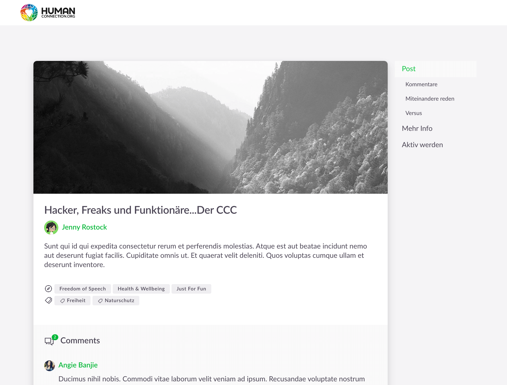

# Web Installation


This documentation should be split into a **local** and a **docker** installation variant. Also maybe there should be a main docker installation guide for the whole system at once!?


## Clone Repository

The Frontend Repository can be found on github.  
[https://github.com/Human-Connection/Nitro-Web](https://github.com/Human-Connection/Nitro-Web)

```bash
git@github.com:Human-Connection/Nitro-Web.git
```

## Install Dependencies


Make sure you are running on Node 10: `node --version`




```bash
cd styleguide && yarn install && cd ..
yarn install
```



```bash
cd styleguide && npm install && cd ..
npm install
```



## Development

To start developing you need to start the server with the dev command. This will give you "hot reload" which updates the browser content \(mostly\) without reloading the whole page.



```bash
yarn dev
```



```bash
npm run dev
```



This will start the UI under [http://localhost:3000](http://localhost:3000)

For development environments, we created three users with different profiles and privileges.

Login to the app with one the following credentials:

* email: user@example.org
* email: moderator@example.org
* email: admin@example.org

password: 1234 \(same for all profiles\)



