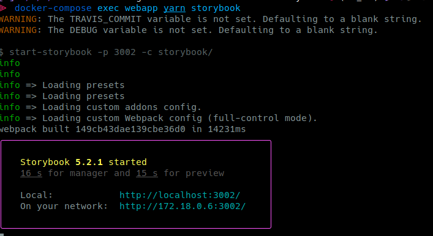

# Component Testing

## Linting

We use [ESLint](https://eslint.org/) to make sure all developers follow certain code guidelines when writing JavaScript.

Most code editors offer an ESLint plugin which helps detect mistakes already while you are writing code. To run the linter manually before pushing up new code type `yarn lint` into your terminal. Most minor issues can be fixed automatically with the command `yarn lint --fix`.

## Unit tests

We write unit tests with the help of [Jest](https://jestjs.io/) and [Vue Test Utils](https://vue-test-utils.vuejs.org/) to make sure our components work in the way they should. In these tests we usually check that a certain input leads to the expected output. They are used to test _functionality_.

To run all tests use the command `yarn test` in the `/webapp` directory. Other useful commands are:
- `yarn test -t test-name` to run tests including `test-name` in their file or test names
- `yarn test -o` to run tests related to files that have been changed since the latest commit

## Documentation and manual testing

[Storybook](https://vue-test-utils.vuejs.org/) is a great tool that performs two important functions in our project:

### Component documentation

With Storybook our components can be documented in detail and offer a visual reference to other developers. When all components are properly documented Storybook can be used as a big component library – where developers can browse through design tokens and components and immediately verify that the component offers the desired functionality.

### Manual testing in an isolated environment

When adding new components or changing existing ones Storybook can be helpful not only to document the feature for future use but also to test different use cases (e.g. by passing different types of `props`) in an isolated playground.

With the right addons Storybook also gives immediate feedback on how well the component complies with accessibility guidelines.

------

To run Storybook first start the app, then enter the following command in a new terminal window: `yarn storybook`. The output should look similar to this:

The Human Connection Storybook will then be available on `http://localhost:3002`.
